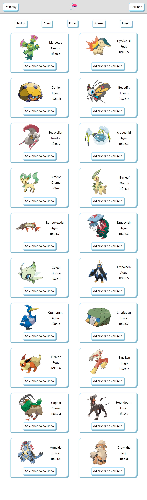
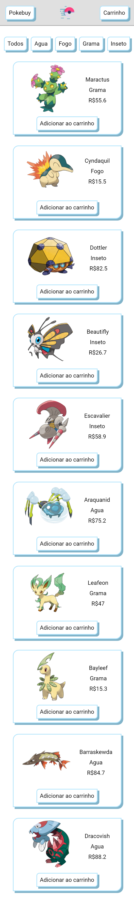

# PokeStore

## :computer:

## :iphone:
<table>
  <tr>
    <td>Tablet</td>
     <td>Mobile Medium</td>
  </tr>
  <tr>
    <td valign="top"></td>
    <td valign="top"></td>
  </tr>
 </table>

 ## Sobre

 Projeto realizado para a materia de "Desenvolvimento de Aplicações para a Internet" do curso de Ciência da Computação, na FCT - Unesp.

 ## Descrição do projeto

 A aplicação consiste na simulação de um site de vendas. Esse site contém, necessariamente, três páginas

 - [x] 1. Página principal com apresentação de produtos
   - [x] a. Listagem de todos produtos disponíveis.
   - [x] b. Produtos fictícios, armazenados em uma variável JavaScript.
   - [x] c. O usuário não precisa entrar em uma página dedicada aos produtos, apenas adicionar os produtos desejados direto da página principal.
   - [x] d. Cada produto deve possuir, no mínimo, os seguintes campos:
     - [x] i. Nome
     - [x] ii. Categoria
     - [x] iii. Preço
     - [x] iv. Imagem associada
     - [x] e. Você deve ter ao menos cinco categorias de produto
     - [X] f. O usuário poderá filtrar produtos por categoria
    
    - [x] 2. Página com detalhes de compra e dados de usuário
        - [x] a. Dados para entrega.
        - [x] b. Resumo da compra.
        - [x] c. Tratar as entradas!

    - [x] 3. Página com confirmação de pedidos
        - [x] a. Página com resumo do pedido.
        - [x] b. Gerar um número aleatório para representar o tempo de frete.

    - [ ] 4. Utilizar banco de dados para armazenamento das informações;
    - [ ] 5. Adicionar filtragens/ordenações por preço;
    - [ ] 6. Implementar um cadastro para o usuário;
    - [ ] 7. Na página de detalhes de compra e dados de usuário, verificar se há um cadastro para o usuário. Se não, realiza-lo antes de prosseguir com pedido.  
