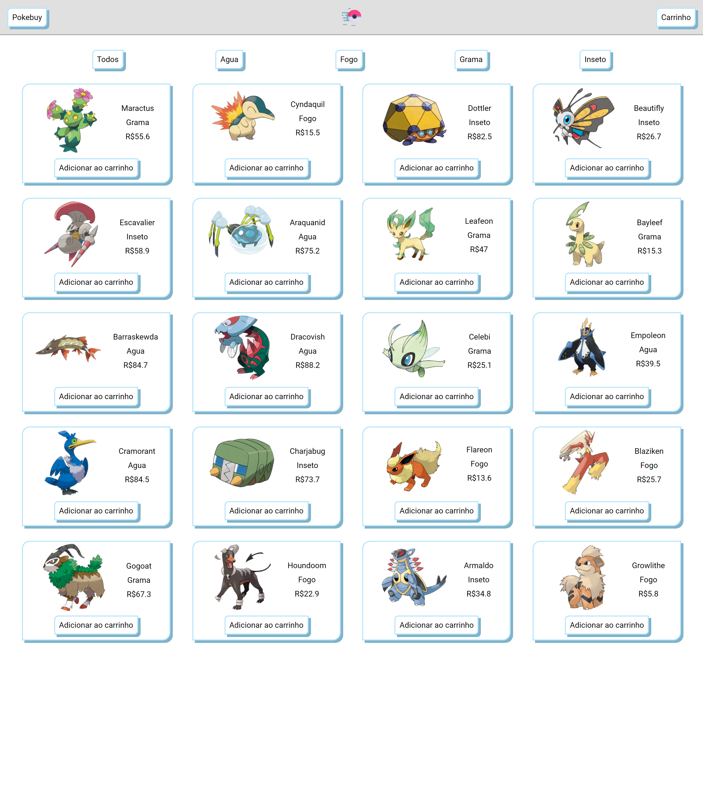

<h1 align="center">PokeStore</h1>

<h2 align="center">Sobre</h2>

 Projeto realizado para a materia de "Desenvolvimento de Aplicações para a Internet" do curso de Ciência da Computação, na FCT - Unesp.

<h2 align="center">💻</h2>

## Descrição do Projeto / UserStories

  
Clique para expandir!

  
  A aplicação consiste na simulação de um site de vendas. Esse site contém, necessariamente, três páginas

 - [x] 1. Página principal com apresentação de produtos
   - [x] a. Listagem de todos produtos disponíveis.
   - [x] b. Produtos fictícios, armazenados em uma variável JavaScript.
   - [x] c. O usuário não precisa entrar em uma página dedicada aos produtos, apenas adicionar os produtos desejados direto da página principal.
   - [x] d. Cada produto deve possuir, no mínimo, os seguintes campos:
     - [x] i. Nome
     - [x] ii. Categoria
     - [x] iii. Preço
     - [x] iv. Imagem associada
     - [x] e. Você deve ter ao menos cinco categorias de produto
     - [X] f. O usuário poderá filtrar produtos por categoria
    
    - [x] 2. Página com detalhes de compra e dados de usuário
        - [x] a. Dados para entrega.
        - [x] b. Resumo da compra.
        - [x] c. Tratar as entradas!

    - [x] 3. Página com confirmação de pedidos
        - [x] a. Página com resumo do pedido.
        - [x] b. Gerar um número aleatório para representar o tempo de frete.

    - [x] 4. Utilizar banco de dados para armazenamento das informações;
    - [x] 5. Adicionar filtragens/ordenações por preço;
    - [x] 6. Implementar um cadastro para o usuário;
    - [x] 7. Na página de detalhes de compra e dados de usuário, verificar se há um cadastro para o usuário. Se não, realiza-lo antes de prosseguir com pedido.  

## Pré-requisitos

Antes de começar, você vai precisar ter instalado em sua máquina as seguintes ferramentas:
[Git](https://git-scm.com), [Node.js](https://nodejs.org/en/). 
Além disto é bom ter um editor para trabalhar com o código como [VSCode](https://code.visualstudio.com/)

## Inicializando a aplicação

Primeiro você vai precisar clonar o repositorio:
  `gh repo clone luan-sabino/PokeStore`

Abra a pasta pelo terminal, e em seguida execute: `node index.js`

O servidor irá iniciar na porta 3000, basta acessar: `localhost:3000`

Obs: Caso queira trocar a porta, basta ir no arquivo `"index.js"`, e alterar a variavel `port`

## 🛠 Tecnologias

As seguintes ferramentas foram usadas na construção do projeto:

- [Express.js](https://expressjs.com/pt-br/)
- [Node.js](https://nodejs.org/en/)
- [SQLite](https://www.sqlite.org/index.html)

### Autor
---

<a href="https://luan-sabino.github.io">
 
  
 <b>Luan Sabino</b></a> <a href="https://luan-sabino.github.io" title="Portifolio">🚀</a>

Feito com ❤️ por Luan Sabino 👋🏽 Entre em contato!

  
